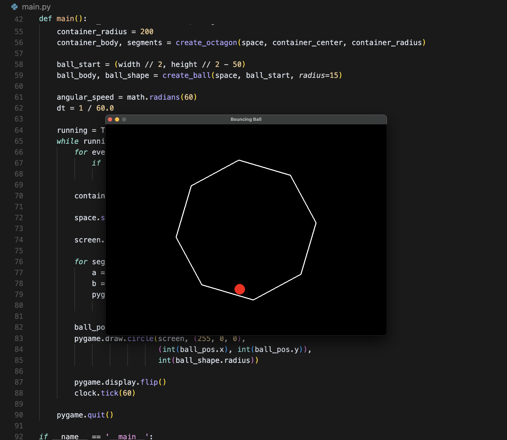

# Rotating Octagon Bouncing Ball Simulation

This project is a physics simulation built with [Pygame](https://www.pygame.org/) and [Pymunk](http://www.pymunk.org/). A red ball bounces inside a rotating octagonal container. The simulation models gravity, friction, and elasticity to create realistic movement.

## What It Does

- Builds an 8-sided (octagonal) container using static line segments
- Simulates a bouncing ball with physics properties
- Continuously rotates the container to create dynamic bouncing behavior
- Renders the simulation in real-time using Pygame

## Showcase



## Requirements

- Python 3.7+
- `pygame`
- `pymunk`

You can install dependencies with:

```bash
pip install pygame pymunk